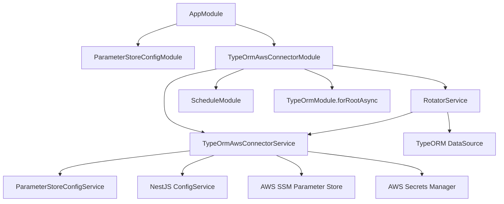
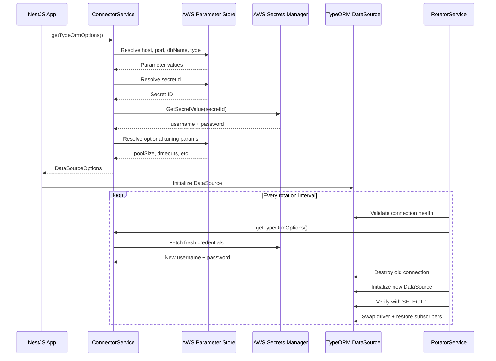

<a id="top"></a>

<p align="center">
  
</p>

<h1 align="center">🔌 NestJS-TypeORM-AWS-Connector</h1>
<p align="center"><em>Seamlessly bridge TypeORM with AWS Parameter Store & Secrets Manager for secure, auto-rotating database connections in NestJS</em></p>

<p align="center">
    <a aria-label="ElsiKora logo" href="https://elsikora.com">
  
</a>           
</p>

## 💡 Highlights

- 🔐 Zero-credential codebase — resolves all database config from AWS SSM Parameter Store & Secrets Manager at runtime
- ♻️ Built-in automatic credential rotation with health checks, emergency recovery, and zero-downtime connection swaps
- 🏗️ Split-source architecture — infra teams own host/port/secrets, app teams own pool/timeout/sync settings independently
- 📦 Dual ESM/CJS module output with full TypeScript declarations and broad NestJS compatibility (v8–v11)

## 📚 Table of Contents
- [Description](#-description)
- [Tech Stack](#-tech-stack)
- [Features](#-features)
- [Architecture](#-architecture)
- [Project Structure](#-project-structure)
- [Prerequisites](#-prerequisites)
- [Installation](#-installation)
- [Usage](#-usage)
- [Roadmap](#-roadmap)
- [FAQ](#-faq)
- [License](#-license)
- [Acknowledgments](#-acknowledgments)

## 📖 Description
**NestJS-TypeORM-AWS-Connector** is a production-grade NestJS module that eliminates the pain of managing database configuration in AWS-hosted applications. Instead of hardcoding credentials or juggling environment variables, this connector resolves your entire TypeORM `DataSourceOptions` from **AWS Systems Manager Parameter Store** and **AWS Secrets Manager** — with built-in credential rotation.

In modern cloud-native architectures, database credentials are rotated regularly for security compliance. Traditional approaches break connections during rotation, causing downtime. This connector solves that with an intelligent **automatic credential rotation service** that seamlessly refreshes database connections with zero downtime, including emergency recovery after consecutive failures.

### Real-World Use Cases

- **ECS Fargate Microservices**: Deploy NestJS APIs on Fargate where credentials are managed by AWS Secrets Manager with automatic rotation policies — the connector picks up fresh credentials without redeployment.
- **Multi-Environment Deployments**: Use the same codebase across `dev`, `staging`, and `production` — each environment resolves its own database configuration from namespaced SSM parameters.
- **Aurora PostgreSQL / RDS MySQL**: Connect to managed AWS databases where infrastructure teams control host, port, and secret references via Parameter Store, while application teams only configure entities and behavior.
- **Compliance-First Organizations**: Meet SOC2 and PCI-DSS requirements by never storing credentials in code, environment files, or container images.

The connector uses a **split-source model**: infrastructure-owned parameters (host, port, secret ID) live in canonical AWS namespaces, while application-owned settings (pool size, timeouts, sync behavior) live in your app's namespace. Raw value overrides let you bypass SSM entirely for local development.

## 🛠️ Tech Stack

| Category | Technologies |
|----------|-------------|
| **Language** | TypeScript |
| **Runtime** | Node.js |
| **Framework** | NestJS |
| **ORM** | TypeORM |
| **Cloud Services** | AWS SSM Parameter Store, AWS Secrets Manager |
| **Build Tool** | Rollup |
| **Linting** | ESLint, Prettier |
| **CI/CD** | GitHub Actions, Semantic Release |
| **Package Manager** | npm |

## 🚀 Features
- ✨ ****AWS Parameter Store Integration** — Resolves database host, port, name, type, and tuning parameters from structured SSM paths with hierarchical namespace support**
- ✨ ****AWS Secrets Manager Integration** — Fetches username/password credentials from Secrets Manager with proper error handling for missing or malformed secrets**
- ✨ ****Automatic Credential Rotation** — Configurable interval-based rotation that swaps database connections with zero downtime, including subscriber preservation**
- ✨ ****Emergency Recovery** — After 3 consecutive rotation failures, automatically attempts full connection recovery with fresh credentials from AWS**
- ✨ ****Connection Health Validation** — Validates both existing and new connections with `SELECT 1` queries before and after rotation**
- ✨ ****Split-Source Configuration Model** — Infrastructure-owned settings (host, port, secret-id) use canonical AWS namespaces; app-owned settings use your module namespace**
- ✨ ****Raw Value Overrides** — Bypass SSM entirely for any field by providing direct values — perfect for local development with `host: '127.0.0.1'`**
- ✨ ****Hierarchical Lookup Resolution** — Field-level SSM lookup → canonical defaults → ssmLookupDefaults → ParameterStoreConfigModule defaults**
- ✨ ****Dual Module Format** — Ships both ESM and CJS builds with full TypeScript declarations and source maps**
- ✨ ****Comprehensive Error Model** — Contextual error messages include the failing field name and full structured lookup context for fast debugging**
- ✨ ****Broad NestJS Compatibility** — Supports NestJS v8 through v11 as peer dependencies**
- ✨ ****Sync & Async Registration** — Use `register()` for static config or `registerAsync()` with factory functions for dynamic configuration**

## 🏗 Architecture

### System Architecture



### Data Flow



## 📁 Project Structure

<details>
<summary>Click to expand</summary>

```
NestJS-TypeORM-AWS-Connector/
├── .github/
│   ├── workflows/
│   │   ├── mirror-to-codecommit.yml
│   │   ├── qodana-quality-scan.yml
│   │   ├── release.yml
│   │   └── snyk-security-scan.yml
│   └── dependabot.yml
├── src/
│   ├── modules/
│   │   └── typeorm-aws-connector/
│   ├── shared/
│   │   ├── constant/
│   │   ├── enum/
│   │   ├── interface/
│   │   ├── provider/
│   │   └── type/
│   └── index.ts
├── CHANGELOG.md
├── commitlint.config.js
├── eslint.config.js
├── LICENSE
├── lint-staged.config.js
├── nest-cli.json
├── package-lock.json
├── package.json
├── prettier.config.js
├── README.md
├── release.config.js
├── rollup.config.js
├── tsconfig.build.json
└── tsconfig.json
```

</details>

## 📋 Prerequisites

- Node.js >= 18.0.0
- npm >= 9.0.0
- @nestjs/common ^8.0.0 || ^9.0.0 || ^10.0.0 || ^11.0.0
- @aws-sdk/client-ssm ^3.535.0
- typeorm ^0.3.20
- @elsikora/nestjs-aws-parameter-store-config ^2.0.1 (installed automatically)
- AWS credentials configured (IAM role, environment variables, or AWS CLI profile)

## 🛠 Installation
```bash
# Install the connector and its required peer dependencies
npm install @elsikora/nestjs-typeorm-aws-connector @aws-sdk/client-ssm @nestjs/common typeorm

# The following are installed automatically as dependencies:
# @aws-sdk/client-secrets-manager
# @elsikora/nestjs-aws-parameter-store-config
# @nestjs/config
# @nestjs/schedule


### Verify Installation


npm ls @elsikora/nestjs-typeorm-aws-connector
```

## 💡 Usage
### Prerequisites: Register Parameter Store Config Module

Before using the connector, register `ParameterStoreConfigModule` from `@elsikora/nestjs-aws-parameter-store-config`:

```typescript
import { Module } from "@nestjs/common";
import { ConfigModule, ConfigService } from "@nestjs/config";
import { ENamespace, ParameterStoreConfigModule } from "@elsikora/nestjs-aws-parameter-store-config";

@Module({
  imports: [
    ConfigModule.forRoot(),
    ParameterStoreConfigModule.registerAsync({
      imports: [ConfigModule],
      inject: [ConfigService],
      useFactory: (configService: ConfigService) => ({
        application: configService.getOrThrow<string>("APPLICATION"),
        config: { region: configService.getOrThrow<string>("AWS_REGION") },
        environment: configService.getOrThrow<string>("ENVIRONMENT"),
        instanceName: "my-api",
        namespace: ENamespace.AWS_ECS_FARGATE,
        shouldDecryptParameters: true,
      }),
    }),
  ],
})
export class AppModule {}
```

---

### Basic Usage: Static Registration

```typescript
import { Module } from "@nestjs/common";
import { TypeOrmModule } from "@nestjs/typeorm";
import {
  TypeOrmAwsConnectorModule,
  TypeOrmAwsConnectorService,
} from "@elsikora/nestjs-typeorm-aws-connector";
import { UserEntity } from "./entities/user.entity";

@Module({
  imports: [
    // Register the connector with your entities
    TypeOrmAwsConnectorModule.register({
      entities: [UserEntity],
    }),
    // Wire it into TypeOrmModule
    TypeOrmModule.forRootAsync({
      imports: [TypeOrmAwsConnectorModule],
      inject: [TypeOrmAwsConnectorService],
      useFactory: async (connector: TypeOrmAwsConnectorService) =>
        connector.getTypeOrmOptions(),
    }),
  ],
})
export class DatabaseModule {}
```

---

### Custom SSM Lookups

Override where specific fields are resolved from in Parameter Store:

```typescript
import { ENamespace } from "@elsikora/nestjs-aws-parameter-store-config";
import { TypeOrmAwsConnectorModule } from "@elsikora/nestjs-typeorm-aws-connector";

TypeOrmAwsConnectorModule.register({
  entities: [UserEntity],
  ssmLookupDefaults: {
    instanceName: "my-api",
    namespace: ENamespace.AWS_ECS_FARGATE,
  },
  ssmLookups: {
    secretId: {
      instanceName: "database",
      namespace: ENamespace.AWS_SECRETS_MANAGER,
      path: ["secret-id"],
    },
    host: {
      instanceName: "aurora-postgres",
      namespace: ENamespace.AWS_RDS,
      path: ["host"],
    },
    port: {
      instanceName: "aurora-postgres",
      namespace: ENamespace.AWS_RDS,
      path: ["port"],
    },
  },
});
```

---

### Local Development: Raw Value Overrides

Bypass AWS entirely for local development:

```typescript
import { EDatabaseType } from "@elsikora/nestjs-typeorm-aws-connector";

TypeOrmAwsConnectorModule.register({
  entities: [UserEntity],
  host: "127.0.0.1",
  port: 5432,
  username: "local-user",
  password: "local-password",
  databaseName: "mydb",
  type: EDatabaseType.POSTGRES,
});
```

---

### Enabling Credential Rotation

Enable automatic credential rotation for long-running services:

```typescript
TypeOrmAwsConnectorModule.register({
  entities: [UserEntity],
  rotation: {
    isEnabled: true,
    intervalMs: 3_600_000, // Rotate every hour
  },
});
```

The rotation service will:
1. Validate current connection health
2. Fetch fresh credentials from AWS Secrets Manager
3. Create a new DataSource with updated credentials
4. Verify the new connection with a `SELECT 1` query
5. Swap the driver seamlessly, preserving all subscribers
6. Attempt emergency recovery after 3 consecutive failures

---

### Async Registration with Factory

```typescript
TypeOrmAwsConnectorModule.registerAsync({
  imports: [ConfigModule],
  inject: [ConfigService],
  useFactory: (configService: ConfigService) => ({
    entities: [UserEntity],
    rotation: {
      isEnabled: configService.get<boolean>("DB_ROTATION_ENABLED", false),
      intervalMs: configService.get<number>("DB_ROTATION_INTERVAL", 3_600_000),
    },
  }),
});
```

---

### Multiple Database Modules In One App

Register the connector separately inside each Nest database module that owns a specific TypeORM connection. The connector module is scoped to that module registration, so multiple connector instances can safely coexist in one application.

```typescript
import { getDataSourceToken } from "@nestjs/typeorm";

TypeOrmAwsConnectorModule.registerAsync({
  dataSourceToken: getDataSourceToken("provider"),
  imports: [ConfigModule],
  inject: [ConfigService],
  useFactory: (configService: ConfigService) => ({
    entities: [ProviderEntity],
  }),
});
```

Use `dataSourceToken` when the connector's `RotatorService` should bind to a named TypeORM `DataSource` instead of the default connection token.

---

### Value Resolution Priority

For each configuration field, values are resolved in this order:

1. **Raw value override** (provided directly in config)
2. **SSM Parameter Store lookup** (via structured lookup)
3. **Built-in default** (only for optional tuning fields like `poolSize`, `connectionTimeoutMs`)

Required fields (`host`, `port`, `databaseName`, `type`, `secretId`) throw explicit errors if not resolvable.

## 🛣 Roadmap

<details>
<summary>Click to expand</summary>

| Task / Feature | Status |
|---|---|
| Dual ESM/CJS module output | ✅ Done |
| AWS Secrets Manager credential resolution | ✅ Done |
| Automatic credential rotation with zero downtime | ✅ Done |
| Emergency recovery after consecutive rotation failures | ✅ Done |
| Split-source configuration model (infra vs app namespaces) | ✅ Done |
| Raw value overrides for local development | ✅ Done |
| Async module registration with factory pattern | ✅ Done |
| Semantic release with prerelease channel | ✅ Done |
| Support for additional database types (e.g., MariaDB, CockroachDB) | 🚧 In Progress |
| Connection pool monitoring and metrics export | 🚧 In Progress |
| Read replica support with separate SSM lookups | 🚧 In Progress |
| Integration test suite with LocalStack | 🚧 In Progress |

</details>

## ❓ FAQ

<details>
<summary>Click to expand</summary>

### ❓ Frequently Asked Questions

**Q: Do I need AWS credentials to use this locally?**
A: No! Use raw value overrides to bypass AWS entirely during local development. Set `host`, `port`, `username`, `password`, `databaseName`, and `type` directly in the config.

**Q: Which databases are supported?**
A: Currently PostgreSQL (`EDatabaseType.POSTGRES`) and MySQL (`EDatabaseType.MYSQL`). The `type` field is resolved from SSM or set directly.

**Q: What happens if AWS Secrets Manager is unreachable during rotation?**
A: The rotation service catches the error, increments a failure counter, and logs it. After 3 consecutive failures, it attempts an emergency recovery with a completely fresh DataSource. The existing connection continues to function until rotation succeeds.

**Q: Can I use this without `@elsikora/nestjs-aws-parameter-store-config`?**
A: No. The connector depends on `ParameterStoreConfigService.get()` for SSM lookups. You must register `ParameterStoreConfigModule` first. However, if you provide raw values for all fields, SSM lookups won't actually be invoked.

**Q: How does the split-source model work?**
A: Infrastructure-owned fields like `host`, `port`, and `secretId` default to canonical AWS namespaces (e.g., `aws-rds/aurora-postgres`). Application-owned fields like `poolSize` and `connectionTimeoutMs` use your app's namespace (e.g., `aws-ecs-fargate/my-api`). You can override any lookup.

**Q: Is this compatible with NestJS v8?**
A: Yes. The peer dependency accepts `@nestjs/common ^8.0.0 || ^9.0.0 || ^10.0.0 || ^11.0.0`.

**Q: How do I disable credential rotation?**
A: Don't set the `rotation` config, or explicitly set `rotation.isEnabled: false`. The `RotatorService` will skip interval registration entirely.

**Q: What's the default rotation interval?**
A: 1 hour (3,600,000 ms). Override it via `rotation.intervalMs` or the SSM path `typeorm/rotation/interval-ms`.

</details>

## 🔒 License
This project is licensed under **MIT**.

## 🙏 Acknowledgments
- **[NestJS](https://nestjs.com/)** — The progressive Node.js framework that makes building server-side applications a joy
- **[TypeORM](https://typeorm.io/)** — The ORM that powers the database layer with decorator-based entity definitions
- **[AWS SDK for JavaScript v3](https://github.com/aws/aws-sdk-js-v3)** — Modular AWS SDK used for SSM and Secrets Manager client operations
- **[@elsikora/nestjs-aws-parameter-store-config](https://github.com/ElsiKora/nestjs-aws-parameter-store-config)** — The Parameter Store config module that provides the structured lookup foundation
- **[Semantic Release](https://semantic-release.gitbook.io/)** — Automated versioning and changelog generation
- **[Rollup](https://rollupjs.org/)** — Module bundler powering the dual ESM/CJS build output
- Built with ❤️ by [ElsiKora](https://github.com/ElsiKora)

---

<p align="center">
  <a href="#top">Back to Top</a>
</p>